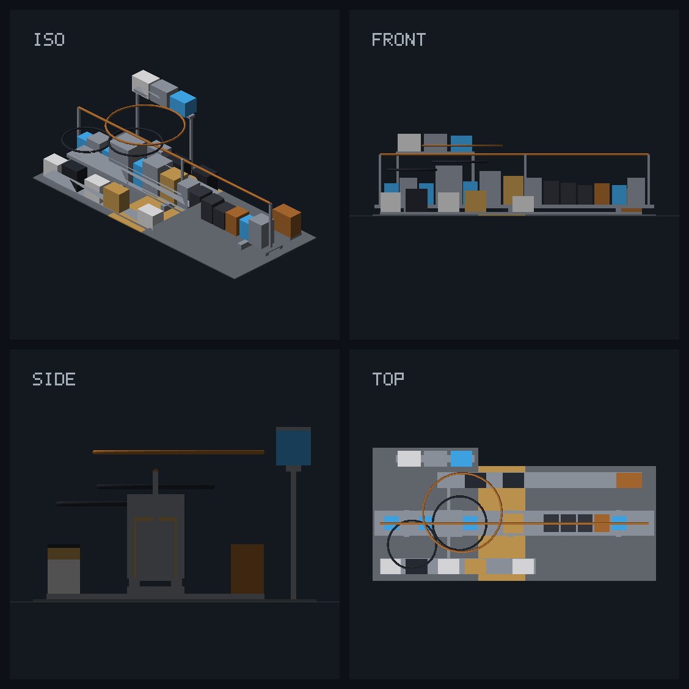

# lean4-speedup

**Profiling-driven research on making Lean 4 compilation faster on CPU** —
measurements, architecture analysis, and experimental compiler patches with a
verification-first methodology.

This repository documents an ongoing investigation into where Lean 4
compilation time actually goes and prototypes optimizations against a fork of
[leanprover/lean4](https://github.com/leanprover/lean4). Every claim is backed
by a benchmark in [`bench/`](bench/), and every optimization ships with a
soundness probe, a determinism check, and an honest account of where it does
*not* help.

> **Bottom line up front:** the campaign's first five optimization tracks
> (T1–T5) were sound but wall-neutral — their value is diagnostic: a precise,
> measured location of the wall-clock lever (sequential main-thread command
> elaboration) and a rigorous methodology. **T6 broke the pattern**: an
> O(k²) literal-defaulting loop in the elaborator, eliminated by a
> memo-skip patch (`Elab.tcSkipUnchanged`) — 4.7× on the microbench,
> **−7.4 % wall on a real numeral-dense Mathlib module, with byte-identical
> output**. See [docs/t6-quadratic-defaulting.md](docs/t6-quadratic-defaulting.md).

## Key results so far

| Finding | Evidence |
|---|---|
| **91 % of typeclass derivations in a hot proof-heavy module are duplicates** — Lean's Meta caches are per-command and wiped on every `addDecl` | [docs/benchmarks.md §3](docs/benchmarks.md) |
| **Cross-command instance cache with pointer-identity invalidation** (experimental patch): 24× on synthetic duplicates, −47 % typeclass CPU on the hot module, sound (mutation probes), deterministic, with proven record-and-replay revalidation (v2) | [docs/benchmarks.md §4-7](docs/benchmarks.md), [patches/](patches/) |
| **System-level finding**: typeclass work rides worker threads in async-era Lean, so the cache's CPU savings (−1 % corpus) don't move single-module wall time — the critical path is the main thread | [docs/benchmarks.md §7](docs/benchmarks.md) |
| **The main thread is the critical path** (~80 % occupied while workers idle); async elaboration currently admits only single mvar-free `theorem`s | [docs/benchmarks.md §5](docs/benchmarks.md) |
| **Async kernel processing for inductives** (experimental patch, module system included): capability sound at corpus scale; performance verdict **null** on Batteries — the motivating "sync kernel" signal proved to be queue-wait, and the honest measurement story (incl. a retraction) is documented | [docs/benchmarks.md §8](docs/benchmarks.md), [docs/t2c-async-inductives.md](docs/t2c-async-inductives.md) |
| Intra-module parallelism plateaus at ~2.4× regardless of cores (Amdahl serial fraction ≈ 40 %) | [docs/benchmarks.md §2](docs/benchmarks.md) |
| **Synthesis — the wall-clock lever is located**: the build is critical-path-bound (10.0 s path vs 8.1 s 16-core floor); the path runs through proof-heavy modules that cap at ~2.9/16 cores. The lever is their intra-module serial decl-dependency fraction — what all three async tracks correctly targeted | [docs/benchmarks.md §9](docs/benchmarks.md) |

## The experimental patch: a global synthInstance cache

Lean re-derives typeclass instances from scratch for every declaration. The
patch (branch `speedup/global-synth-cache`, exported in [`patches/`](patches/))
adds a process-lifetime cache with two novel ingredients:

1. **Pointer-identity invalidation** — a cache entry is stamped with the
   instance-table / default-instance / reducibility extension state *objects*.
   Since the environment only grows and unrelated declarations never touch
   those objects, pointer equality is an O(1), sound, and precise witness that
   a cached derivation is still valid.
2. **Context-shape keys** — goals under binders (`BEq α`, …) are keyed by the
   alpha-normalized telescope of (goal, local instances), so isomorphic
   contexts across hundreds of lemmas share one entry; results are stored as
   closed lambdas and re-applied to the target context.

Both are gated behind options (`synthInstance.globalCache`,
`synthInstance.globalCache.shape`) for A/B measurement.

## Architecture notes

The measured pipeline (with a 3D model of the compiler grounded in the Lean 4
thesis and system paper, built with
[visually-3d](https://github.com/grandchildrice/visually-3d)):



See [docs/architecture.md](docs/architecture.md) for the pipeline diagram,
zoning, and source map.

## Reproducing

```bash
# 1. Toolchain: apply patches/ to leanprover/lean4 @ 4f53dd7, then
cd lean4 && nix develop --command bash -c "cmake --preset release && make -C build/release -j14"
elan toolchain link speedup-stage1 lean4/build/release/stage1

# 2. Corpus: Batteries pinned to the toolchain, then e.g.
cd batteries && lake env lean --profile Batteries/Data/List/Lemmas.lean

# 3. A/B the cache:
lake env lean -DsynthInstance.globalCache=false --profile Batteries/Data/List/Lemmas.lean

# 4. Count duplicate derivations:
lake env lean -Dtrace.Meta.synthInstance.cache=true Batteries/Data/List/Lemmas.lean \
  | grep -oE '\] (new|cached|global|shape): ' | sort | uniq -c
```

Full methodology and raw numbers: [docs/benchmarks.md](docs/benchmarks.md).

## Repository layout

| path | contents |
|---|---|
| [`docs/`](docs/) | benchmark reports with charts, architecture notes, design documents |
| [`patches/`](patches/) | the experimental commits against lean4 `4f53dd7` |
| [`bench/`](bench/) | benchmark sources, probes, and raw logs |
| [`PLAN.md`](PLAN.md) | research journal: track portfolio and per-iteration log |

## Three campaigns, and where they landed

Each optimization was implemented, verified for soundness, and measured
honestly — including where it does *not* help.

| Campaign | What it does | Verdict |
|---|---|---|
| **T1 — global synthInstance cache** | cross-command instance reuse (pointer-identity + shape keys + record-and-replay revalidation) | **CPU-real, wall-neutral.** −47 % typeclass CPU on the hot module, sound + deterministic; but typeclass work rides worker threads, so single-module wall is unchanged. |
| **T2c — async inductive kernel processing** | move `inductive`/`structure` kernel work off the main thread (module system included; byte-exact Lean-side recursor builder) | **Sound, perf-null.** The motivating "sync kernel" signal was queue-wait, not work. Includes a documented retraction after a measurement-harness flaw. |
| **T2a — async by-proofs** | elaborate `by` blocks as async auxiliary theorems | **Sound subset perf-null; general case blocked.** Under-context proofs are entangled with the def's metavariable web and can't be soundly outlined. |
| **T3 — critical-path module fission** ([doc](docs/t3-module-fission.md)) | split the hottest critical-path module into dependency-independent fragments (build-level command parallelism, zero compiler changes) | **Mechanism validated, perf-neutral.** Fragments compile concurrently and downstream builds clean, but the giant dependency component (59 % of decls) holds 86 % of the time — time-fissility, not count-fissility, is the limit, re-confirming the synthesis from a fourth angle. |
| **T4 — the `alias` pipeline barrier** ([doc](docs/t4-alias-barrier.md)) | `alias` stalls the main thread until the target's transitive async cone retires (394 ms for one hot alias); gdb stack sampling named both forcing sites (`find?`→`toConstantInfo`; env-ext `getState`) | **Stall eliminated at probe level** (+100 ms → noise) by a 2-site Batteries-side fix ([patch](patches/batteries-0001-alias-async-stall-fix.patch)); corpus wall-neutral (slack absorbs it). Generalizes: env-ext state reads in metaprogram commands are a silent barrier *class*; Mathlib-scale upstream candidate. |
| **T5 — ext-state barrier audit** ([doc](docs/t5-ext-state-barriers.md)) | census of `lean_task_get` blocking across a vanilla hot-module compile; grind/sym workers convoy on reducibility ext-state reads (49/58 hits); `.local`-read core patch | **Sound, perf-null under strict same-stage1 A/B** — the convoy is momentary and off the critical path; also caught the stale v4.32 plateau baseline (the toolchain itself improved ~40 %). |
| **T6 — quadratic literal defaulting** ([doc](docs/t6-quadratic-defaulting.md)) | the synthetic-mvar resumption loop re-attempts every pending TC mvar after each single success — O(k²) in chained literals (99.6 ms/command at k=16); memo-skip patch `Elab.tcSkipUnchanged` | **First real wall win.** 4.7× microbench, **−7.4 % wall on a numeral-dense Mathlib module**, oleans byte-identical ON-vs-OFF, corpus clean + deterministic. Filed upstream: [#14448](https://github.com/leanprover/lean4/issues/14448) / [#14449](https://github.com/leanprover/lean4/pull/14449). |
| **T9 — command-independence census** ([doc](docs/t9-command-independence.md)) | statement-dependency DAGs measured: depth ≤ 3 def-rooted hubs vs 164–339 sequential commands; wavefront simulator predicts a 4.0× statement-phase ceiling | **C1 speculative command elaboration funded** (gate ≥2× passed); textual order is a ~99 %-empty over-serialization. The census's critical chain exposed T10. |
| **T10 — section-telescope re-elaboration tax** ([doc](docs/t10-variable-telescope-tax.md)) | every command re-elaborates the full accumulated `variable` telescope (`runTermElabM`/`elabVariable`); O(k²) per section, 22 % of the hottest Mathlib module; cached-telescope patch `Elab.varTelescopeCache` + `resetDiag` allocation guard | **Largest wall win so far: −12.2 % on the hottest Mathlib module** (4.91 → 4.31 s, 5-run medians), k=256 chain 6.3×, probes + 188/188 corpus green; olean deltas proven structurally zero (physical layout only). Three snapshot-soundness hazards found and closed (ngen rollback, error states, auto-bounds). |

## Conclusion: the wall-clock lever, located

A module-DAG critical-path analysis (docs/benchmarks §9) shows the Batteries
build is **critical-path-bound** (10.0 s weighted path vs 8.1 s 16-core
floor), and the path runs through proof-heavy modules. A thread-level profile
then sharpens it: **main-thread command/statement elaboration ≈ wall time**,
while proof bodies already parallelize across ~26 workers.

So proof-body parallelism is a solved problem, and all three async campaigns
correctly targeted the remaining serial fraction — but none could break it,
because it is the **sequential elaboration of theorem statements and commands
on the main thread**. The single highest lever, and the hardest change, is
**command-level parallelism**: elaborating independent theorem statements
concurrently, which Lean's frontend does sequentially by design (macro /
environment ordering). That is the precise, measured target for future work.

## Status & caveats

Research code, not a production toolchain. Patches are option-gated
experiments (defaults on in the fork for measurement convenience); known gaps
(unification-hint stamping, universe-name-sensitive shape keys, olean
alternate-normal-form drift) are documented in the patch headers and design
docs. Nothing here has been proposed upstream. The durable output is the
**measurement methodology** (asserted harness, 5-run medians, soundness gate
before any perf claim, honest retractions) and a **precise map of where Lean's
async boundary can and cannot move**.

## License

Documentation and research notes: CC-BY-4.0. Patches to Lean 4 follow Lean's
Apache-2.0. Benchmarks build on
[Batteries](https://github.com/leanprover-community/batteries) and
[Mathlib](https://github.com/leanprover-community/mathlib4) (Apache-2.0).
