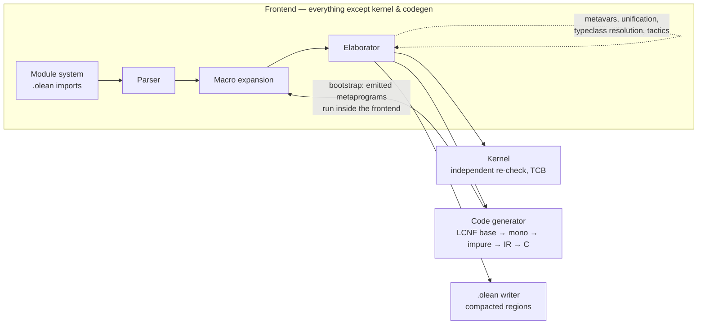

# Lean 4 compiler architecture (as measured, 4.34.0-pre @ 4f53dd7)

Ground truth: the `lean4/` clone in this workspace, the Lean 4 system paper
(de Moura & Ullrich, CADE-28) and Ullrich's thesis Fig. 3.1. The 3D model below
was built by `visually-3d` **grounded in those sources** and formally checked
(architecture mode: station order, frontend/TCB zoning, feedback loops).

## Pipeline

Key structural facts that matter for performance work:

- **The elaborator is the heavyweight.** `src/Lean/Meta` (4.9 MB of source:
  unifier, `whnf`, typeclass synthesis, `simp` engine) plus `src/Lean/Elab`
  (3.9 MB) dwarf the kernel (420 KB C++) and runtime (828 KB C++).
- **One module = one `lean` process.** `lake` schedules module processes in
  parallel; inside a process, commands elaborate with internal task
  parallelism (proof bodies asynchronous since ~4.19).
- **Meta caches are per-command.** `synthInstance`/`whnf`/`inferType`/`defEq`
  caches live in `Meta.State`; every environment modification wipes them
  (`Elab/Command.lean:894-898`), and each command starts fresh.
- **LCNF chain** (`src/Lean/Compiler/LCNF/`): base → mono → impure passes with
  progressive type/proof erasure, then IR → C (reference counting per
  *Counting Immutable Beans*).

## 3D model (visually-3d scene, score 89/100, verify ✓)

Reading guide: the three floor pads are the thesis's explicit zoning —
frontend (parser→elaborator gantry, with pretty printer / language server /
editor overhead), the trusted-code-base pad (kernel, forged steel), and the
code-generator pad (LCNF chain, heights descending 1.5→1.10 as types and
proofs are erased; copper = reference-counting subsystem). The orange spine is
the dataflow bus; the tori are the macro-expansion / elaboration / bootstrap
fixpoint loops.

## Source map

| Area | Path | Size | Role |
|---|---|---|---|
| Elaborator | `src/Lean/Elab/` | 3.9M | commands, terms, tactics |
| Meta | `src/Lean/Meta/` | 4.9M | unifier, whnf, **SynthInstance.lean**, simp |
| Codegen | `src/Lean/Compiler/LCNF/` | 1.3M | erasure pipeline → C |
| Kernel | `src/kernel/` | 420K | C++ independent checker (TCB) |
| Runtime | `src/runtime/` | 828K | C++ RC runtime |
