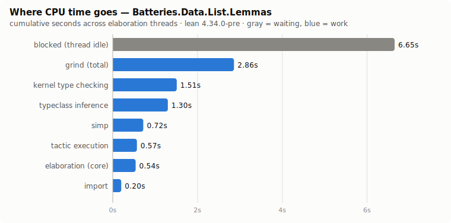
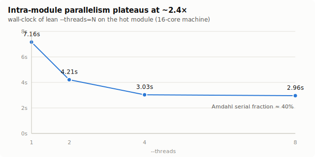
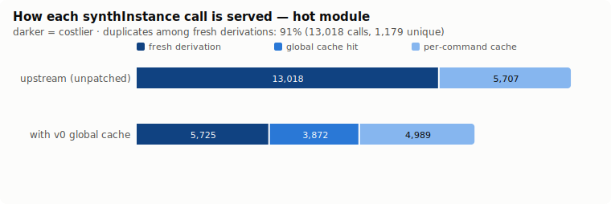
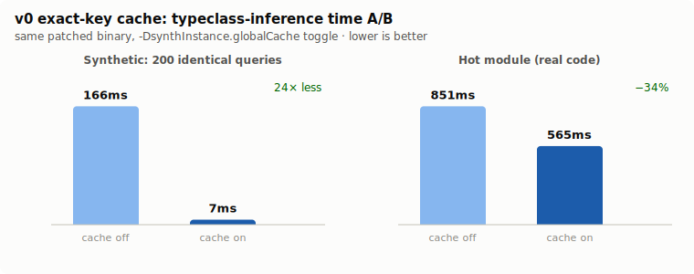
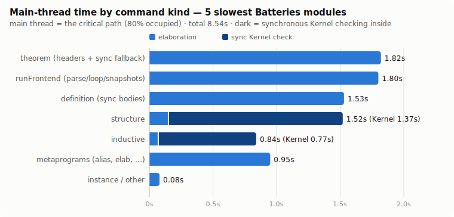

# Benchmarks & measurements

Machine: 16-core linux (NixOS), Lean 4.32.0 (elan) for baselines; patched
builds are stage1 of 4.34.0-pre @ `4f53dd7` + the `speedup/global-synth-cache`
branch (patches in `../patches/`). Corpus: Batteries (`leanprover-community/batteries`).
All raw logs live in `../bench/`.

## 1. Where does compile time go?

Cold `lake build` of Batteries v4.32.0: **15.1 s wall / 148 s user CPU**
(1146 % of 16 cores, 217 jobs, slowest module 4.8 s) — so ~28 % of core
capacity idles on the critical path, and per-module cost dominates.

Per-category cumulative profile of the heaviest module
(`Batteries.Data.List.Lemmas`, `lean --profile`):



| category | cumulative time |
|---|---|
| blocked (thread idle) | 6.65 s |
| grind (total incl. simp/ematch) | 2.86 s |
| kernel type checking | 1.51 s |
| typeclass inference (incl. sym) | 1.30 s |
| simp | 0.72 s |
| tactic execution | 0.57 s |
| elaboration (core) | 0.54 s |
| import | 0.20 s |

The single largest line is *waiting*, not work: threads blocked on the
declaration dependency chain.

## 2. Intra-module parallelism plateaus



| `--threads` | wall | user |
|---|---|---|
| 1 | 7.16 s | 6.97 s |
| 2 | 4.21 s | 7.22 s |
| 4 | 3.03 s | 7.54 s |
| 8 | 2.96 s | 8.04 s |

Speedup saturates at **~2.4× on 4 threads** → Amdahl serial fraction ≈ 40 %.
(Note: `LEAN_NUM_THREADS` is a no-op; the knob is `-j/--threads`.)

## 3. Typeclass re-derivation waste (track T1's motivation)

Counted with `-Dtrace.Meta.synthInstance.cache=true` (a `new:` line = a real
derivation, i.e. a per-command cache miss):

- Hot module, upstream: **13,018 real derivations, 1,179 unique → 91 %
  duplicates.** `OfNat Int 1` alone is fully re-derived 774×.
- The stock per-command cache absorbs only 30 % of calls (5,707 hits).
- Root cause in source: Meta caches are wiped by every `addDecl`
  (`Elab/Command.lean:894-898`) and dropped at each command boundary.



| run | fresh derivation | global cache hit | per-command hit |
|---|---|---|---|
| upstream | 13,018 | — | 5,707 |
| v0 global cache | 5,725 | 3,872 | 4,989 |

## 4. v0 exact-key global cache — A/B results

Same patched binary, toggled with `-DsynthInstance.globalCache=false`.



| benchmark | cache off | cache on | delta |
|---|---|---|---|
| synthetic 200 identical queries, TC time | 166 ms | 7 ms | **−96 % (24×)** |
| hot module, TC time (incl. sym) | 851 ms | 565 ms | **−34 %** |
| Batteries cold build, user CPU | 126.8 s | 126.8 s | ±0 |

Verification battery:

- **Mutation probe** ✓ — a cached *failure* for `Inhabited MyT` flips to
  success the moment the instance is added (pointer-identity invalidation
  works).
- **Determinism** ✓ — OFF-vs-OFF and ON-vs-ON cold builds produce
  byte-identical .oleans.
- **ON-vs-OFF oleans differ** in ~30 metaprogramming-heavy modules: cache
  reuse changes universe-parameter/mvar numbering — a *stable alternate
  normal form* (builds succeed, downstream type-checks). Needs canonical
  renormalization before upstreaming.

**Why the corpus win is ~0:** the duplicates v0 can reach are cheap closed
goals; the expensive duplicate mass sits under binders (`BEq α`, …) where the
exact key contains per-command `FVarId`s and can never match across commands.
This is what motivates v1 (context-shape keys, alpha-normalized telescopes) —
see `../PLAN.md` track T1.

## 5. Track T2: the main thread is the critical path

From trace-profiler samples of the 5 slowest modules: the main thread is
~80 % occupied while worker threads idle at 0.7–1.0 s each — intra-module
wall-clock is gated by what runs *synchronously on main*:



| main-thread bucket | time | share |
|---|---|---|
| theorem (headers + sync fallback) | 1.82 s | 21.3 % |
| runFrontend self (parse 56 ms; rest loop/snapshots/import) | 1.80 s | 21.1 % |
| definition (sync bodies) | 1.53 s | 17.9 % |
| structure — **of which sync Kernel 1.37 s** | 1.52 s | 17.8 % |
| inductive — **of which sync Kernel 0.77 s** | 0.84 s | 9.9 % |
| metaprogram commands (alias, elab, …) | 0.95 s | 10.6 % |

Two findings drive the T2 inventions:

- **Async elaboration admits only single mvar-free `theorem`s**
  (`MutualDef.lean:1236`); `def`/`instance`/`example` bodies are
  synchronous → T2a: demand-driven async def bodies.
- **Kernel checking of inductives/structures is synchronous**
  (`AddDecl.lean:129` — no async rule for `inductDecl`), and on WF-heavy
  modules it is the single largest critical-path item (BinomialHeap:
  1.31 s = 60 % of the module) → T2c: async inductive checking, design in
  [t2c-async-inductives.md](t2c-async-inductives.md).

## 6. Mathlib A/B (iter 13)

A ~1000-module Mathlib prefix builds under the patched toolchain. On
TC-heavy *hierarchy-bootstrap* modules the cache shows ~no effect
(Hom.Defs 287/282 ms; WithBot 671/741 ms; InjSurj 313/286 ms): these
modules add instances nearly every command, so the whole-table pointer
stamp invalidates continuously — while proof-heavy lemma files (the
Batteries hot module) hold −34…47 % TC. This cleanly identifies **v2**:
per-class version stamps + touched-class sets (the original red/green
design), so instance growth in class C only invalidates derivations that
touched C.

## Reproduce

```bash
# baseline profile of the hot module
cd batteries && lake env lean --profile Batteries/Data/List/Lemmas.lean

# duplicate counting
lake env lean -Dtrace.Meta.synthInstance.cache=true Batteries/Data/List/Lemmas.lean \
  | grep -oE '\] (new|cached|global|shape): ' | sort | uniq -c

# patched toolchain (after applying ../patches to leanprover/lean4 and
# building stage1 via `nix develop` + `cmake --preset release && make -C build/release`)
elan toolchain link speedup-stage1 <lean4>/build/release/stage1
```
