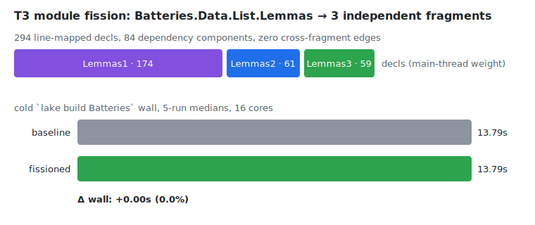

# T3 — critical-path module fission ("nuclear fission" transfer)

Status: v0 measured (iter 50). The first track that attacks the wall named by
the iter-48/49 synthesis — sequential main-thread command elaboration on
critical-path modules — **without touching the compiler**: the build system
itself becomes the command-level-parallelism vehicle.

## The analogy

Nuclear fission: a heavy nucleus releases energy when split, *iff* the binding
energy between the fragments is small relative to their mass. Transfer:

| physics | build |
|---|---|
| heavy nucleus | critical-path module (`Batteries.Data.List.Lemmas`, 2.09 s wall, main-thread-bound) |
| fragment mass | per-fragment sequential command-elaboration time |
| binding energy | cross-fragment decl dependencies (they force an import edge = serialization) |
| fissility parameter | DAG width: can the decl graph split into balanced parts with **zero** cross edges? |

The iter-49 profile is what makes fission pay: proof *bodies* already run on
workers; the module's wall is its ~2.3 s of *sequential main-thread* statement
and command elaboration. Two files get two main threads. So fragment weight is
**decl count** (main-thread cost is spread ~uniformly, ~8 ms/command), *not*
proof CPU time — the giant proof-time component (11.9 of 16.1 s worker CPU)
is irrelevant to the cut.

## Fissility measurement (bench/DeclDag.lean → list_lemmas_dag.jsonl)

- 339 user-facing decls, only 347 intra-module edges, longest chain 11 →
  the DAG is wide and shallow. The module is *highly fissile*.
- Undirected components: 84 (giant = 162 decls, then 16/14/12/8/8/…, 55
  singletons). Components align with the file's `/-! ### topic -/` blocks.
- Any *contiguous* cut has one-way binding (later slices depend on earlier) →
  fragments would import each other → serial. The correct cut is
  **connected components of the block graph, bin-packed** → zero cross-fragment
  deps by construction.

## Implementation (bench/fission_split.py)

Splits at topic-block granularity (sections stay whole inside their block):

- block-level dep graph from the decl DAG → components → greedy 3-way pack by
  decl count → `Lemmas1/2/3.lean` = shared prelude + that fragment's blocks in
  original order; `Lemmas.lean` becomes a stub that `public import`s all three
  (module-system re-export ⇒ downstream files unchanged).
- Two correctness subtleties found by the first failing build:
  1. **Naked top-level `attribute [grind =]/[simp]` lines** register lemmas
     that arbitrary *other* blocks' grind/simp proofs consume — invisible in
     the term-level DAG. Fix: hoist all of them into every fragment's prelude
     (exactly one copy per fragment; the import-time extension merge across
     fragments is tolerated — full downstream build is clean).
  2. **`open Option` scope**: it opens mid-file and scopes to EOF; replicating
     it at the top of every fragment broke `or_assoc` (ambiguous vs
     `Option.or_assoc`). Fix: re-open it only before blocks that originally
     sat after the `open` line.

## Results (5-run medians, cold `lake build Batteries`, 16 cores)



| | wall (median of 5) | oleans | rc |
|---|---|---|---|
| baseline | **13.79 s** (13.69–13.99) | 188 | 0 all runs |
| fissioned | **13.79 s** (13.58–14.08) | 191 | 0 all runs |

Per-module job times (last run each): baseline `Lemmas` **3.7 s**; fission
`Lemmas1` **3.2 s** ∥ `Lemmas2` 1.8 s ∥ `Lemmas3` 1.1 s, stub 282 ms.

**Verdict: mechanism validated, perf-neutral — and the reason is the
project's sharpest datum yet.** The fragments genuinely compile concurrently
and the full downstream corpus builds clean (behavior preserved). But the
giant dependency component — 59 % of the decls — carries **86 % of the
module's time** (3.2 of 3.7 s). Sequential main-thread cost is *not* uniform
per command; it concentrates in exactly the component that cannot be cut.
Count-fissility was high; **time-fissility is what matters, and it is low.**
The critical chain through the module improves only 3.7 → ~3.5 s, invisible
in whole-build noise.

This re-confirms the iter-48/49 synthesis from a fourth independent angle
(after T1/T2c/T2a): the intra-module decl-dependency core is the fundamental
wall. Fission is the cheapest possible probe of that claim — no compiler
changes — and it reproduces it.

## Reproducing

```bash
cd batteries && lake env lean --run ../bench/DeclDag.lean > ../bench/list_lemmas_dag.jsonl
python3 ../bench/fission_split.py   # writes Lemmas{1,2,3}.lean + stub
../bench/t3_ab.sh                   # 5+5 cold-build A/B
```

The batteries working tree is restored to pristine after the experiment; the
split is fully regenerable from the two scripts above.

## Scope and next

- The technique would pay on a critical-path module whose *time* distributes
  across components. A pre-check is now cheap: DAG + per-component time
  weighting (DeclDag + trace.profiler) = a measured fissility parameter
  before any split is attempted. `List.Basic` (2.1 s job) is the next
  candidate, but as a def-module its DAG is likely chainier.
- Cutting *inside* a component needs one-way fragment imports (serial — no
  gain) or decl duplication (unsound for public names) — not pursued.
