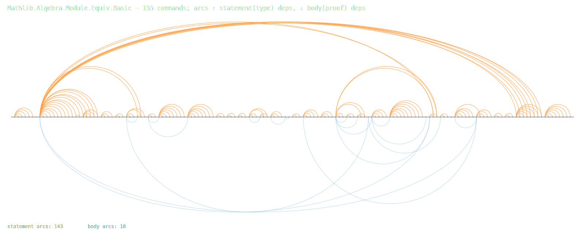
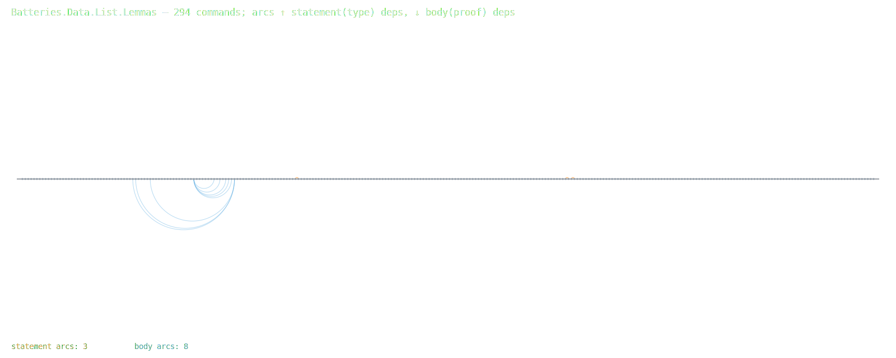

# T9 — the command-independence census (the phenomenon inventory)

2026-07-19, iter 75. Protocol v2 step 2: before inventing, measure the
harnessable regularity. The contradiction (from iters 48/49/72): the wall
is sequential main-thread command elaboration, but commands *feel*
independent. Is that a real, exploitable structure?

## Method

`bench/StmtDeps_batteries.lean` / `bench/StmtDeps_mathlib.lean` (run via
`lake env lean` in the corpus tree): for every user-facing decl of a
target module, extract same-module constants referenced by its **type**
(the statement — what the sequential main thread elaborates) separately
from its **value/aux decls** (the body — already async on workers).
Private aux names are mapped through `privateToUserName?` then folded into
their user-facing parent (`._proof_N`, `.match_N`, numeric `eq_N`).
Command order ≈ line order. Analysis: `bench/stmtdeps_analyze.py`;
renders: `bench/stmtdeps_arcs.py` → `docs/assets/arcs-*.svg`.

Known approximations (all bias toward *overstating* independence — this
census is the optimistic bound, real speculation needs violation repair):

- Elaboration-context deps (open/variable/notation/set_option/macros) are
  not counted; the census argument is they are reconstructible or rare
  writers (C5 census owed).
- An instance consulted during TC but absent from the final type is
  uncounted (rare: chosen instances appear in the elaborated type).
- 45 (Batteries) / 9 (Mathlib) private decls lack declaration ranges
  (line 0); verified isolated — 0 statement/body edges into them — so
  excluded from ordered stats without effect.

## Results

| metric | Batteries List.Lemmas | Mathlib Equiv.Basic |
|---|---|---|
| user-facing decls | 339 | 164 |
| statements with ZERO same-module type deps | **99 %** | 24 % |
| fully import-only decls (stmt+body) | 97 % | 15 % |
| stmt reads nothing from previous 1 cmd | 99 % | 80 % |
| stmt reads nothing from previous 8 cmds | 99 % | 30 % |
| min-dist to nearest stmt dep (median) | 1 (n=3) | 2 |
| **statement-dep chain** | **2** vs 339 sequential | **3** vs 164 sequential |
| full-dep chain (stmt+body) | 2 | 4 |

Hub analysis (Equiv.Basic): 143 statement arcs land on only 33 targets;
top hub `LinearEquiv.automorphismGroup`-area defs at cmd 7 takes 28 arcs;
**every top-10 hub is a def**, each followed by a comb of lemma statements
about it. With the top-5 hubs committed, 50 % of all statements are
dep-free. The Batteries render is visually a flat line (3 statement arcs
in the whole module).

## The phenomenon, stated

**Statement-dependency DAGs are shallow (depth ≤ 3–4) def-rooted
hub-and-spoke graphs; theorem statements — the TC-heavy sequential mass —
are almost exclusively spokes.** Textual command order is a ~99 %-empty
over-serialization of a depth-3 partial order.

This is the harnessable regularity behind speculative/wavefront command
elaboration (C1 in [c-expansions.md](c-expansions.md)): elaborate def
hubs on the wavefront; fan out theorem statements to workers the moment
their hubs commit. In the ideal, a 164-step sequential phase becomes a
depth-3 wave — and the statement-phase TC volume (the measured Mathlib
wall, 1.3–1.7 cores) spreads across all cores.

## The gate result (iter 76): C1 FUNDED

Simulator (`bench/wavefront_sim.py` on `bench/equiv_basic_cmdprof.txt`,
240 `[Elab.command]` spans ≥1 ms, 5,969 ms total; 142/155 census decls
mapped): sequential 5,969 ms → wavefront critical path **1,477 ms (4.0×)**
with 16 workers 1,509 ms (4.0×), 8 workers 3.4×, 4 workers 2.5×. Model:
true ctx writers (bare variable/open/section/end — `variable … in` counts
as a decl command) form a sequential chain each command depends on;
census statement deps add decl→decl edges; simps-generated decls ride
their parent's command. Honest error bars: 33 ambiguous-name skips and
unmatched commands lose census edges (optimistic), repair/commit costs
unmodeled (optimistic), fully-sequential ctx chain (pessimistic).
Gate threshold was ≥2× → **C1 funded for a deep prototype box**.

Two by-catches from the critical chain:

1. The chain is dominated by the ctx-writer chain — 82 bare `variable`
   commands, 1,306 ms (22 % of the module), growing 20→81 ms within a
   section and resetting at section boundaries: a second T6-class
   quadratic, mechanism located in core. Split out as
   [t10-variable-telescope-tax.md](t10-variable-telescope-tax.md) — and
   T10's fix is a *prerequisite* for cheap C1 scope materialization.
2. Prior-art (searches, 2026-07): upstream parallelism (4.17–4.19 series)
   covers proof bodies + kernel + generators; out-of-order command
   elaboration is unclaimed; the community explicitly notes the
   `variable` design "conflicts with parallel compilation". C1's atypical
   ingredient is open ground.
